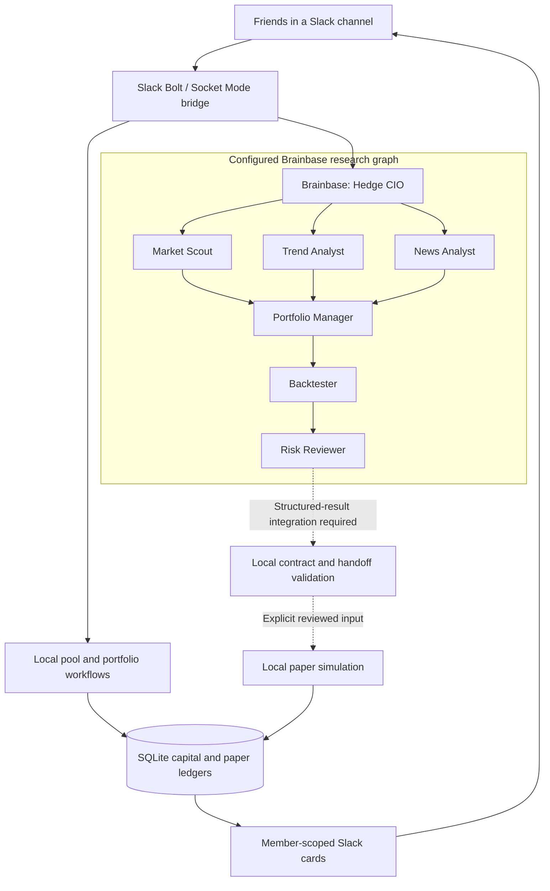

<div align="center">

# Hedge

### Your group chat. An investment team behind it.

**A Slack-native investing club powered by Brainbase agents and a deterministic finance engine.**

[Architecture](#architecture) · [Brainbase](#brainbase-the-research-infrastructure) · [Quickstart](#quickstart) · [Slack setup](#slack-setup) · [Technical docs](#technical-docs)

`Python 3.11+` · `Brainbase` · `Gemini` · `Daytona` · `MCP` · `Slack` · `SQLite` · `Yahoo Finance`

</div>

---

Sharing a ticker is easy. Investing together needs more: a shared mandate, contribution records, research, position sizing, and someone willing to reject a bad idea.

Hedge puts that process inside Slack. Friends create a virtual pool, define their strategy, and ask an AI investment team to investigate opportunities. Local code—not model output—owns the accounting, validates decisions, and enforces paper-trading controls.

> **Paper-only by design.** Hedge is an investing-club prototype, not a regulated hedge fund, custodian, or brokerage. It does not collect payments, accept real deposits, support withdrawals, or submit broker orders. Research and backtests are not investment advice or guarantees of return.

## What you can do

| Capability | What it means |
| --- | --- |
| **Create a club** | Set a virtual starting balance, mandate, risk level, and invited Slack members. |
| **Track contributions** | Confirm virtual contributions and calculate exact contribution-based ownership. |
| **Plan a budget** | Split a virtual budget equally or by weight, with cents-exact allocation. |
| **Research together** | Send investment questions and thread context to the Brainbase CIO. |
| **Inspect your stake** | View member-scoped contribution, portfolio, and position cards in Slack. |
| **Test an idea locally** | Backtest reviewed decisions with historical bars, fees, and slippage. |
| **Simulate with controls** | Validate decisions, apply risk limits, and persist paper positions and audit records. |

### Current implementation boundary

The components below are intentionally not presented as one fully automated trading pipeline.

- **Local implementation:** pool lifecycle, contribution accounting, Slack confirmation flows, portfolio cards, decision validation, backtesting, and durable paper portfolios.
- **Brainbase configuration:** seven agent manifests, a directed orchestration graph, model/runtime configuration, and MCP connections. The Slack bridge creates and tracks CIO tasks.
- **Limited research delivery:** the CLI path can return a conservatively filtered **Unreviewed CIO market snapshot**. This is unverified transcript text, not an authenticated specialist result, risk approval, or trade instruction.
- **Integration work remaining:** authenticated, task-bound structured results for the complete research → portfolio → backtest → risk chain. Graph edges and completed tasks alone do not prove that chain ran successfully.
- **Explicitly disabled:** all IBKR submission paths, including `hedge submit-paper`. Local simulation does not contact a broker.

## Architecture



There are three separate responsibilities:

| Layer | Owns | Does not own |
| --- | --- | --- |
| **Slack bridge** | Inbound events, canonical thread identity, signed actions, member authorization, task tracking | Model-selected destinations or broker authority |
| **Brainbase** | Agent runtime, research tasks, configured delegation, model/tool access | Member capital or broker execution |
| **Local finance engine** | Exact accounting, schema validation, risk checks, paper simulation, persistence | Autonomous live trading |

## Brainbase: the research infrastructure

### Agents as configuration, not a single giant prompt

The team lives in [`brainbase/agents/`](brainbase/agents/). Each agent has its own manifest and instruction file. The graph is defined in [`brainbase-orchestration.yaml`](brainbase/brainbase-orchestration.yaml).

The checked-in manifests specify:

| Setting | Configuration |
| --- | --- |
| Runtime | `machine_kind: daytona` |
| Agent harness | `harness: kafka` |
| Default model | `gemini-3.8-flash` |
| Capabilities | Memory, browser, and Slack enabled in the agent configuration |
| Tools | Thread-scoped Brainbase MCP connections for orchestration, memory, and browser access |
| Deployment | Brainbase CLI, with agent instructions and graph stored in source control |

Here, **Kafka is the agent harness name**. Hedge does not require a separately operated Apache Kafka cluster. These are checked-in settings, not a guarantee of model availability in another Brainbase account. Enabled capabilities also do not bypass Hedge's trusted Slack-delivery checks.

### Fan out for research. Converge for a decision.

| Agent | Responsibility | Boundary |
| --- | --- | --- |
| **Hedge CIO** | Interpret the question and coordinate work | Research context is not approval |
| **Market Scout** | Investigate market conditions and candidate stocks | Findings must identify evidence or missing data |
| **Trend Analyst** | Evaluate price action and momentum | A signal is not a position |
| **News Analyst** | Investigate company news and catalysts | Source material remains untrusted input |
| **Portfolio Manager** | Combine findings into an allocation proposal | Produces a draft, not an approved decision |
| **Backtester** | Review historical support for the proposal | Missing or failed testing is not a pass |
| **Risk Reviewer** | Issue `APPROVED`, `HOLD`, or `REJECTED` | Sole terminal decision role |

The graph has three research branches and one terminal risk gate. It represents the intended handoff order; actual scheduling, artifact provenance, and successful completion must be verified separately. A configured Backtester agent does not itself prove that the local backtest engine was invoked.

### Typed handoffs

[`orchestration_protocol.py`](src/hedge/orchestration_protocol.py) implements the validation boundary for:

```text
ResearchRequest
  → SpecialistReport(s)
  → PortfolioDraft
  → BacktestReport
  → RiskReviewAttestation
```

Artifacts carry run, workspace, channel, and root-thread identity; timestamps and a deadline; role and status; and SHA-256 hashes of their parent artifacts. Local validation checks that the chain belongs to the same request and binds each step to the preceding output.

An approved attestation carries a strict `hedge.decision.v1` document and its hash. `HOLD` and `REJECTED` carry no decision. Trusted adapter code must supply identity and compute hashes: a model writing a plausible hash or task ID is not proof of provenance.

### Result delivery is a separate trust boundary

The bridge persists task-to-thread correlation and starts a bounded status monitor. Delivery reserves an identity before sending to Slack, so ambiguous sends are not automatically retried. This gives at-most-once send attempts, **not** guaranteed delivery.

The current CLI does not provide the authenticated typed-result transport needed to release a complete reviewed chain. A restricted fallback can extract explicitly headed market-only sections from a completed CIO transcript and label them **Unreviewed CIO market snapshot**. It cannot certify accuracy, freshness, specialist completion, or risk approval. Rejected, unavailable, and timed-out results produce fixed notices instead.

See the [current fallback behavior](docs/brainbase-cio-research-fallback.md), [typed protocol](docs/orchestration-protocol.md), and [structured-result integration requirements](docs/brainbase-result-delivery.md). The latter includes historical wiring notes; current task registration and monitoring are implemented in the bridge.

## The finance engine

### Exact capital accounting

Virtual contributions live in an append-only SQLite ledger. Money-like values use **integer cents**; ownership uses **exact fractions**:

```text
member ownership = member cumulative virtual contributions / pool virtual contributions
```

Simulated NAV is allocated using the largest-remainder method so member values add up to the exact total. Stable event IDs make identical retries harmless; reusing an ID with different data is rejected.

This is contribution-based simulation accounting, not production fund share issuance, fee accounting, or time-weighted performance. Pool lifecycle units and capital-ledger ownership are separate; the capital ledger is authoritative for member value.

### Durable paper portfolios

Each pool has a separate SQLite paper-portfolio database holding cash, positions, FIFO acquisition lots, quotes, decisions, and audit transitions.

- A decision's account changes and audit records commit atomically within that portfolio database.
- Identical decision retries return the stored result, including after restart.
- Quotes must be complete, finite, positive, nonfuture, and fresh; the default freshness window is five minutes.
- Unrepresentable per-share cost basis is rejected for fund dashboard inputs rather than rounded silently.
- Capital contributions and paper cash are separate stores. The bridge reconciles contribution event IDs and amounts before presenting NAV.
- Interrupted cross-store updates block affected views until repaired; they are not advertised as one atomic transaction.

### Deterministic risk checks

The default `PaperPolicy` permits paper mode, market/limit orders, at most **8 orders per decision**, and at most **100 shares per order**. The simulator additionally checks cash, covered sells, per-order notional, position size, and gross exposure against configured limits.

```text
PROPOSED → VALIDATED → RISK_APPROVED → SIMULATED → COMPLETED
                  ↘ REJECTED
       active kill switch → HALTED
```

The local `RISK_APPROVED` state means the deterministic gate passed; it is not proof that a Brainbase Risk Reviewer completed its work. The CLI `validate` command checks the decision contract and `PaperPolicy`, not portfolio affordability, current prices, or full research provenance.

### Reproducible backtesting

The isolated backtest engine consumes local OHLCV bars and reviewed, timestamped decisions. It supports:

- Fills only on a bar **strictly after** the signal timestamp.
- Market fills at the eligible open, with adverse slippage.
- Limit fills only when the eligible bar crosses the limit.
- Per-order commissions, cash checks, and covered-sell checks.
- Fill/rejection ledgers, equity curves, total return, maximum drawdown, and win rate.

The optional Yahoo adapter fetches daily bars through `yfinance` and can save snapshots with query metadata and a SHA-256 digest for repeatable offline runs. It does not supply a licensed point-in-time dataset. Signal timestamps remain the caller's responsibility; corporate actions, survivorship, and trading halts are not modeled. Yahoo data may be delayed, revised, incomplete, or unavailable.

## Quickstart

Run commands from the repository root. You need **Python 3.11+** and [uv](https://docs.astral.sh/uv/).

### 1. Install

```bash
uv sync --extra yahoo --extra slack
```

The core package has no mandatory third-party runtime dependencies. Slack and Yahoo support are optional extras. No broker credentials are needed.

### 2. Validate an example decision offline

```bash
uv run hedge validate examples/paper-decision.json
```

Expected output:

```json
{"ok": true, "decision_id": "dec_demo_aapl_001", "intents": 1}
```

The example's `$1.00` AAPL limit is deliberately unusable as a realistic trade. It demonstrates a contract, not an investment recommendation. Validation does not submit or simulate an order.

### 3. Run a local backtest

```bash
uv run python sandbox/run_backtest.py \
  --config sandbox/backtest_config.example.json \
  --bars sandbox/bars.example.csv \
  --decisions sandbox/decisions.example.json \
  --output /tmp/hedge-backtest.json
```

This reads local files and writes JSON metrics, positions, fills, and the equity curve. It does not contact Slack, Brainbase, Yahoo, or a broker.

### 4. Fetch a research price — optional, network required

```bash
uv run hedge quote AAPL
```

Returns the latest available **daily close**, timestamp, and Yahoo Finance source URL—not a streaming or guaranteed real-time quote.

## Slack setup

### Install the apps

Follow the [multi-profile deployment guide](docs/slack-multi-profile.md). The [CIO manifest](slack/manifest.yaml) is the only inbound Socket Mode app. Six specialist manifests define outbound-only profiles with `chat:write`; they do not receive events.

Use distinct credentials for each role and keep them outside the repository. Invite the required bots to the intended public channel. Authenticate the Brainbase CLI separately and configure/deploy your agent team before routing research requests.

### Configure the bridge

Supply these values through a private runtime environment or secret manager:

| Variable | Purpose |
| --- | --- |
| `SLACK_BOT_TOKEN` | CIO bot token |
| `SLACK_APP_TOKEN` | CIO Socket Mode app token |
| `HEDGE_APPROVED_WORKSPACE_IDS` | Required comma-separated workspace allowlist |
| `HEDGE_APPROVED_CHANNEL_IDS` | Required channel allowlist; explicit IDs are recommended |
| `HEDGE_SLACK_ACTION_SECRET` | Private action-signing key, at least 16 bytes |
| `HEDGE_CIO_AGENT_ID` | Your CIO agent ID; otherwise the checked-in deployment ID is used |
| `HEDGE_CIO_MODEL` | Optional task-level model override; checked-in agent default is `gemini-3.8-flash` |

`HEDGE_APPROVED_CHANNEL_IDS=*` allows channels in approved workspaces where the bot receives events. Prefer a narrow list. Empty allowlists reject inbound events and actions.

The [environment template](deploy/slack.env.template) lists the specialist token variables too. **Also set `HEDGE_APPROVED_WORKSPACE_IDS`; the template does not currently include it.**

Then run:

```bash
uv run hedge-slack-bridge
```

This starts an actual Slack connection and task monitor. It is not part of the offline quickstart. The scripts under `scripts/` and launchd configuration under `deploy/` are operator-specific macOS examples, not portable installers.

<details>
<summary><strong>Persistence paths and operational notes</strong></summary>

| Variable | Purpose |
| --- | --- |
| `HEDGE_SLACK_STATE_DB` | Canonical Slack threads, inbound claims, and delivery state |
| `HEDGE_BRAINBASE_TASK_DB` | Persistent Brainbase task registration and tracking |
| `HEDGE_SLACK_FUND_DRAFT_DB` | Pending pool/join confirmation records |
| `HEDGE_PAPER_FUND_DB` | Pool lifecycle and authoritative capital records |
| `HEDGE_PAPER_PORTFOLIO_DIR` | Separate paper-portfolio databases per pool |

Keep the fund and draft databases distinct. Preserve paths and the action-signing key across restarts. Restrict local file permissions and back up related databases together. These stores contain member identities and accounting records, not broker credentials.

See [local Slack workflows](docs/slack-live-workflows.md) for defaults, confirmation semantics, and recovery requirements.

</details>

### A $500 club walkthrough

A starting balance belongs to the creator; invitations do **not** split it automatically. For a $500 pool across three friends, use `$166.68` for the creator and `$166.66` for each invited member.

Replace the example user IDs with actual Slack mentions:

```text
@Hedge create virtual pool Hackathon Club | USD 166.68 | mandate: Long only US equities research | risk: low | members: <@U123>, <@U456>
```

1. The creator clicks **Confirm virtual pool**.
2. Each invited user sends the following with the returned pool ID and confirms their own join:

   ```text
   @Hedge join virtual pool pool-<id> | USD 166.66
   ```

3. Members inspect their records:

   ```text
   @Hedge portfolio
   @Hedge my stake
   @Hedge positions
   ```

4. Start a separate research request:

   ```text
   @Hedge compare AAPL and MSFT for a long-only US equities strategy.
   Review price trends, recent news, and the main risks. Cite your sources.
   ```

Research routes to Brainbase; it does not change the pool's holdings. A cash-only account can show simulated starting NAV. Priced positions require reconciled persisted holdings and fresh quotes.

**Budget planning is a different workflow:** a request such as `@Hedge split a budget` opens the virtual split planner. Confirming its preview does not create a pool or record actual member contributions.

## Development

### Repository map

```text
brainbase/              Agent manifests, instructions, and orchestration graph
src/hedge/
  slack_bridge.py       Socket Mode ingress, local workflows, CIO task launch
  brainbase_delivery.py Task registry, monitor, result validation, fallback
  slack_state.py        Durable thread/event/delivery correlation
  slack_delivery.py     Role-authorized outbound delivery
  slack_ui.py           Block Kit cards, modals, signed metadata
  virtual_pool.py       Pool and invitation lifecycle
  member_accounts.py    Exact contribution accounting and NAV allocation
  fund_service.py       Member-authorized fund views and reconciliation
  contracts.py          Versioned decision and trade-intent types
  orchestration_protocol.py  Typed research handoff validation
  policy.py             Deterministic paper-policy constraints
  risk_controls.py      Position, cash, and exposure checks
  trading_system.py     In-memory paper simulation state machine
  paper_portfolio.py    Durable per-pool portfolios and audit records
  backtest.py           Isolated historical simulation engine
  yahoo_history.py      Read-only daily OHLCV import and snapshots
  realtime.py           Bounded market-event primitives
  inference.py          Deadline-bound CIO inference interface
  flows.py              Normalized report data
  dashboard.py          Self-contained HTML paper reports
slack/                  CIO/specialist app manifests and role registry
sandbox/                File-only backtest runner and sample inputs
examples/               Decision-contract example
tests/                  Local contract and behavior tests
docs/                   Detailed subsystem and operating guides
```

The real-time inference modules are foundations with injected feed/transport interfaces, not a live market feed or autonomous trading service. The HTML dashboard is a generated local report, not a hosted web application.

### Tests

Install test tooling into the project environment:

```bash
uv pip install pytest
uv run python -m pytest -q
```

Focused checks:

```bash
uv run python -m pytest -q \
  tests/test_contracts.py tests/test_orchestration_protocol.py \
  tests/test_member_accounts.py tests/test_paper_portfolio.py \
  tests/test_backtest.py tests/test_slack_bridge.py
```

Tests use local fixtures, temporary SQLite databases, and fake transports. Passing tests do not prove a live Slack/Brainbase deployment or market-data connection is working.

### Brainbase configuration changes

With the Brainbase CLI installed and authenticated:

```bash
cd brainbase
brainbase orchestration status --json
```

Review the graph and agent instructions before publishing changes. Deployment is an explicit operation:

```bash
brainbase orchestration push --yes
```

Per-agent configuration is managed with `brainbase agent push` from the agent directory. Do not put Slack tokens, Brainbase credentials, or runtime state into source control.

## Technical docs

| Area | Read more |
| --- | --- |
| Slack installation | [Deployment](docs/slack-deploy.md) · [Role/profile contract](docs/slack-multi-profile.md) |
| Club workflows | [Pool creation, joins, and cards](docs/slack-live-workflows.md) · [Budget planner](docs/slack-budget-split-ui.md) |
| Brainbase integration | [Rollout requirements](docs/brainbase-live-rollout.md) · [Structured results](docs/brainbase-result-delivery.md) · [CIO fallback](docs/brainbase-cio-research-fallback.md) |
| Contracts | [Decision contract](docs/decision-contract.md) · [Handoff protocol](docs/orchestration-protocol.md) |
| Accounting | [Virtual pools](docs/virtual-pools.md) · [Member capital](docs/member-capital-accounts.md) · [Fund service](docs/fund-service.md) |
| Paper simulation | [Trading system](docs/trading-system.md) · [Durable portfolios](docs/paper-portfolio-persistence.md) |
| Historical research | [Backtest sandbox](docs/backtesting-sandbox.md) · [Yahoo data](docs/yahoo-backtest-data.md) |
| Reporting | [Flows and charts](docs/flows-and-charts.md) · [Local dashboard](dashboard/README.md) |
| Event-driven foundations | [Real-time inference](docs/realtime-inference.md) |

---

**AI researches. Code checks. Friends decide.**
