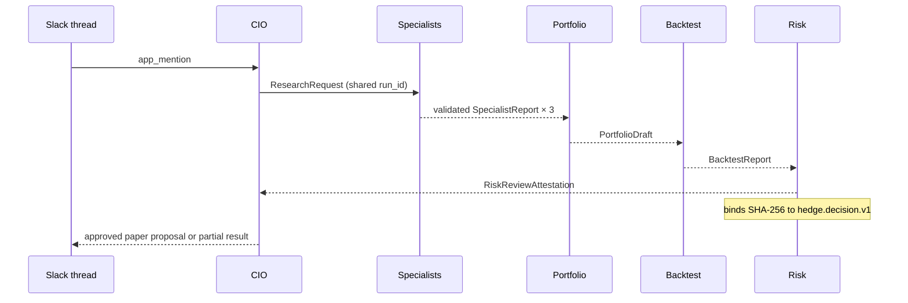

# Hedge

> **A Slack-native investment committee for transparent, paper-only portfolio research.**

Hedge turns a question in Slack into a bounded research process: independent market, trend, and news analysis; a portfolio draft; a reproducible backtest; and a final risk attestation. It records virtual pool contributions and never submits a live order.

[](docs/decision-contract.md)
[](pyproject.toml)
[](tests)

## Why Hedge

Investment clubs usually scatter context across chat messages, spreadsheets, and unstructured opinions. Hedge keeps the discussion in Slack while producing a reviewable, typed record of each proposal. Every agent has one job, every handoff is validated, and the final decision is attached to the same thread that started the request.

```mermaid
flowchart LR
    U[Slack member] -->|@Hedge research AAPL| CIO[Hedge CIO]
    CIO --> M[Market Scout]
    CIO --> T[Trend Analyst]
    CIO --> N[News Analyst]
    M --> P[Portfolio Manager]
    T --> P
    N --> P
    P --> B[Backtester]
    B --> R[Risk Reviewer]
    R -->|signed attestation| CIO
    CIO -->|threaded summary| U

    classDef gate fill:#dcfce7,stroke:#15803d,color:#14532d;
    class R gate;
```

## The research contract

Hedge uses fixed, typed artifacts rather than free-form agent claims:



The terminal Risk Reviewer is the only role that can approve, hold, or reject a paper proposal. A proposal is visible only after its attestation validates against the exact canonical decision object.

## What Hedge does

| Slack request | Response path | Result |
| --- | --- | --- |
| `@Hedge hi` | Local CIO fast path | A concise explanation in under two seconds |
| `@Hedge create a $500 budget split…` | Local Block Kit flow | A cents-exact virtual contribution preview |
| `@Hedge research AAPL` | Parallel research fan-out | Distinct specialist updates in the original thread |
| `@Hedge propose an allocation` | Portfolio → backtest → risk | A reviewed paper proposal, if approved |

Hedge uses Yahoo Finance for deployable market data and supports local dashboards, virtual pools, contribution accounting, paper portfolio persistence, and reproducible backtest inputs.

## Safety by design

- **Paper only.** Live broker submission is disabled in `src/hedge/broker.py`.
- **No model-controlled routing.** An agent cannot choose a Slack token, profile, channel, or thread timestamp.
- **Thread affinity.** Every run is bound to a workspace, channel, root thread, requester, deadline, and UUID run ID.
- **Fail closed.** Hash mismatches, stale output, cross-run artifacts, duplicate events, and wrong-role delivery are rejected.
- **Virtual contributions only.** Budget splits plan a group allocation; they do not create accounts, move money, or execute trades.

## Architecture

```mermaid
flowchart TB
    subgraph Slack[Slack]
        Mention[@Hedge mention]
        Thread[Original root thread]
        Profiles[Role profiles]
    end

    subgraph Local[Trusted local bridge]
        Ingress[Socket Mode ingress]
        State[(Durable SQLite state)]
        Outbox[Durable delivery outbox]
        Guard[Correlation + schema guard]
    end

    subgraph Brainbase[Brainbase / Kafka]
        Graph[Seven-role orchestration]
    end

    subgraph Data[Read-only data]
        Yahoo[Yahoo Finance]
        Ledger[Virtual pool ledger]
    end

    Mention --> Ingress --> State
    Ingress --> Graph
    Graph --> Guard --> Outbox --> Profiles --> Thread
    Yahoo --> Graph
    Ledger --> Guard
```

The local bridge is the Slack trust boundary. Brainbase runs the research graph; it does not decide where to post. The outbox chooses from an immutable role-to-profile map and posts exactly once to the originating thread.

## Quick start

```bash
uv sync --all-extras
uv run hedge quote AAPL
uv run hedge validate examples/paper-decision.json
uv run --with pytest pytest -q
```

The full suite currently reports **193 passed, 9 subtests passed**.

For a local Slack bridge deployment, follow [the Slack deployment guide](docs/slack-deploy.md). Credentials are kept outside the repository and loaded from the macOS login Keychain.

## Project map

| Path | Purpose |
| --- | --- |
| [`src/hedge`](src/hedge) | Paper portfolio, Slack bridge, typed contracts, research and risk controls |
| [`brainbase`](brainbase) | Seven-agent Kafka orchestration manifests |
| [`slack`](slack) | CIO and specialist Slack app manifests plus the immutable profile map |
| [`docs`](docs) | Deployment, protocol, budget UI, dashboard, and safety documentation |
| [`tests`](tests) | Unit and fake-backed integration coverage |
| [`dashboard`](dashboard) | Self-contained local portfolio report renderer |

## Demo path

1. Mention `@Hedge` in an approved Slack channel.
2. Ask for research on a ticker such as AAPL.
3. Watch Market Scout, Trend Analyst, and News Analyst return concise findings in the original thread.
4. Request a paper allocation.
5. Review the final Risk Reviewer attestation and the CIO summary.

## Built for the Startup Speedrun Hackathon

Hedge is designed to make the investment-club workflow legible: fast enough to start in chat, structured enough to review, and constrained enough to remain paper-only. The result is a reusable operating system for group research rather than another opaque trading bot.

## Documentation

- [Multi-profile Slack design](docs/slack-multi-profile.md)
- [Typed orchestration protocol](docs/orchestration-protocol.md)
- [Decision contract](docs/decision-contract.md)
- [Budget split UI](docs/slack-budget-split-ui.md)
- [Paper portfolio persistence](docs/paper-portfolio-persistence.md)
- [Local dashboard and charts](docs/flows-and-charts.md)

---

Hedge is research and virtual planning software. It does not provide investment advice or execute trades.
